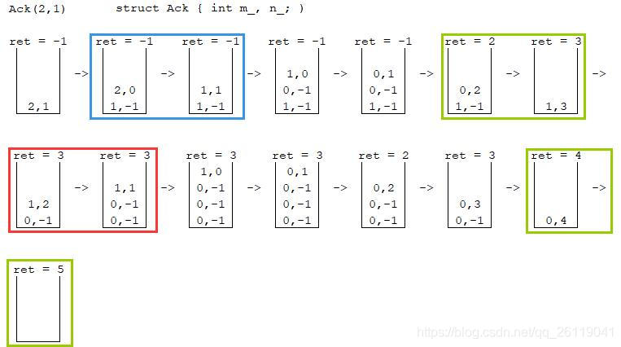

# 一、Ackermann函数
$$
Ack(m,n)=
\begin{cases}
n+1& m=0 \\\
Ack(m-1,1)& m>0,n=0 \\\
Ack(m-1,Ack(m,n-1))& m>0,n>0
\end{cases}
$$
Ackermannn函数输出值增长速度非常快，仅是对于(4,3)的输出已大得不能准确计算。

$Ack(0,n)=n+1\\\
Ack(1,n)=n+2\\\
Ack(2,n)=2n+3\\\
Ack(3,n)=2^{n+3}-3\\\
Ack(4,n)=2^{2^{2^{\cdot^{\cdot^{\cdot^{2}}}}}}-3（n+3个2）$

# 二、C++实现
## 1. 递归实现
按照表达式直接写，非常简单。
```cpp
int Ack(int m, int n) {
    if(m == 0) return n + 1;
    if(n == 0) return Ack(m - 1, 1);
    return Ack(m - 1, Ack(m, n - 1));
}
```

## 2. 栈模拟递归

观察表达式，显然只有$m=0$的情况才能直接求得具体值，因此递归的出口一定$m=0$。

先将问题具体化，例如求$Ack(2,1)$的值，手动演算一下，<b>每一次取栈顶的时候都同时出栈</b>，栈的变化如图：



**先分析不那么特殊的两种情况：**
①$n=0$，如蓝框过程。
则$(m-1,1)$入栈。

②$m>0,n>0$，如红框过程。
由于$n$的值也需要通过$Ack$函数求出，先标记为$-1$，即待求值，将$(m-1,-1)$入栈；
然后将求$n$的值的$Ack$函数入栈，即$(m,n-1)$入栈。

**然后考虑$m=0$的情况：**
如绿框过程。由于$m=0$时，函数求得了具体值，先更新返回值``ret``为``n + 1``。
通过栈是否为空判断是中间过程还是递归出口，栈空则说明达到了递归出口。
①中间过程，即前面一个绿框过程。
返回值为之前讨论的“用``-1``标记的待求的``n``”，因此更新栈顶的``n``。
②递归出口，即后面的绿框过程。栈空，说明没有待更新、待求值的了，该返回值即最终结果。


```cpp
#include <stack>

int Ack_non_recursion(int m, int n) {
    struct Ack {    // Ackermann结构体
        int m_, n_;
        Ack(int m, int n) : m_(m), n_(n) {} // 构造函数
    } Node(m, n);

    stack<Ack> s;   // STL栈
    s.push(Node);   // 初始值入栈

    int ret = -1;   // Ackermann函数的返回值

    while(!s.empty()) {
        Node = s.top(); // 取栈顶的值
        s.pop();        // 并且出栈
        if(Node.m_ == 0) {  // 第一种情况，m 等于 0
            ret = Node.n_ + 1;  // 返回值为 n + 1
            if(s.empty())   // 如果栈空了，说明不需要继续向上返回，已经得到了最终结果
                break;      // 跳出循环
            Node = s.top(); // 否则，更新栈顶结点（第三种情况中 用 -1 标记的待计算的 n 的值）
            s.pop();        // 先出栈
            Node.n_ = ret;  // n 修改为返回值
            s.push(Node);   // 再重新入栈
        }
        else if(Node.n_ == 0) { // 第二种情况，n 等于 0
            s.push(Ack(Node.m_ - 1, 1));    // Ack(m - 1, 1) 入栈
        }
        else {  // 第三种情况，m, n 都大于 0
            s.push(Ack(Node.m_ - 1, -1));   // 用 -1 标记 n ，表示还没有计算出值，Ack(m - 1, -1) 入栈
            s.push(Ack(Node.m_, Node.n_ - 1));  // 要计算 n 的值，Ack(m, n - 1) 入栈
        }
    }
    return ret;
}
```
