@[toc]
# Java IDEA配置JDBC连接SQL Server数据库和代码提示

初学数据库和Java，记录一下配置Java连接SQL Server的过程。

## 启用SQL Server的TCP/IP协议连接

到「`开始菜单->Microsoft SQL Server->SQL Server 2019 配置管理器`」，选择「`SQL网络配置 -> <实例名字>的协议`」，启用所有协议。

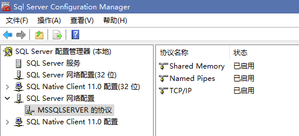

再回到「`SQL Server服务`」，右键`SQL Server`选择重启。

SQL Server的默认TCP端口号为1433，因此我们可以打开CMD测试一下。

在CMD中输入执行`telnet localhost 1433`，如果无法连接说明配置有误，可以去配置管理器里双击TCP/IP，拉到最下面，查看一下端口号。

如果跳转到了Telnet窗口（右边那样，只有一个光标在闪），就是成功了。

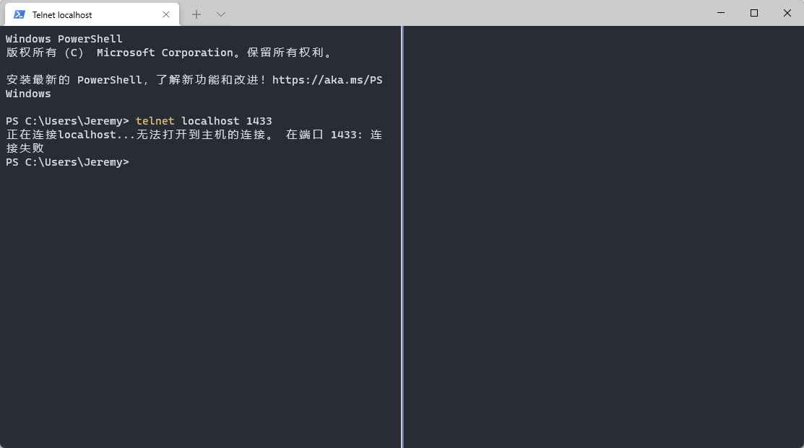

## 下载JDBC驱动

### JDBC驱动版本选择

**如果是SQL Server 2012及以上，可以跳过这一步。**

到「[支持矩阵 - JDBC Driver for SQL Server | Microsoft Docs](https://docs.microsoft.com/zh-cn/sql/connect/jdbc/microsoft-jdbc-driver-for-sql-server-support-matrix?view=sql-server-ver15#sql-version-compatibility)」查询与你的数据库兼容的JDBC版本号。

### 微软官网下载

如果是SQL Server 2012及以上，直接到「[下载 - JDBC Driver for SQL Server | Microsoft Docs](https://docs.microsoft.com/zh-cn/sql/connect/jdbc/download-microsoft-jdbc-driver-for-sql-server?view=sql-server-ver15)」下载。

否则，到「[支持矩阵 - JDBC Driver for SQL Server | Microsoft Docs](https://docs.microsoft.com/zh-cn/sql/connect/jdbc/microsoft-jdbc-driver-for-sql-server-support-matrix?view=sql-server-ver15#sql-version-compatibility)」下载与你的数据库兼容的JDBC版本。

下载后解压，目录结构应如「`<安装目录>\sqljdbc_<版本>\<语言>\<具体文件>`」，内含若干个`.jar`文件，对应了不同版本的JDK支持。

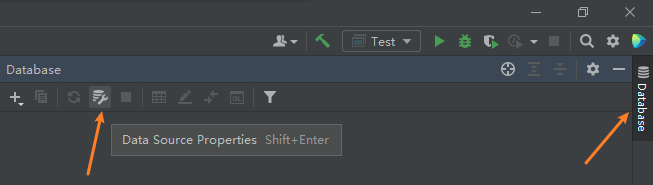

由于`.jar`向下兼容，因此JDK 16用JDK 1.8的包也没问题。`release.txt`文件中也写出了各`jar`的支持列表：

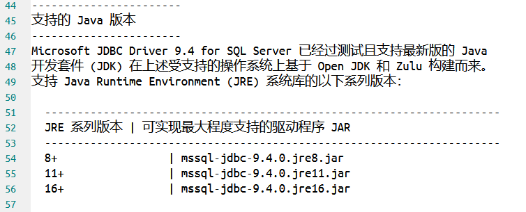

但是注意，如果JDK 15用了JDK 16的`JAR`包，因为Major Version比16的小，会出现版本不兼容的异常：

`Exception in thread "main" java.lang.UnsupportedClassVersionError: com/microsoft/sqlserver/jdbc/SQLServerDriver has been compiled by a more recent version of the Java Runtime (class file version 60.0), this version of the Java Runtime only recognizes class file versions up to 59.0`

### JetBrains自带下载

首先进`Settings->Plugins`，确保已经安装和启用了`Database Tools and SQL`插件，一般IDEA自带，不需要另行下载。

双击shift搜索`Data Source`，进入数据源设置。也可以选择右边的`Database`标签，选择`Data Source Properties`。

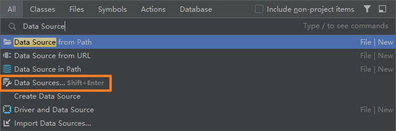

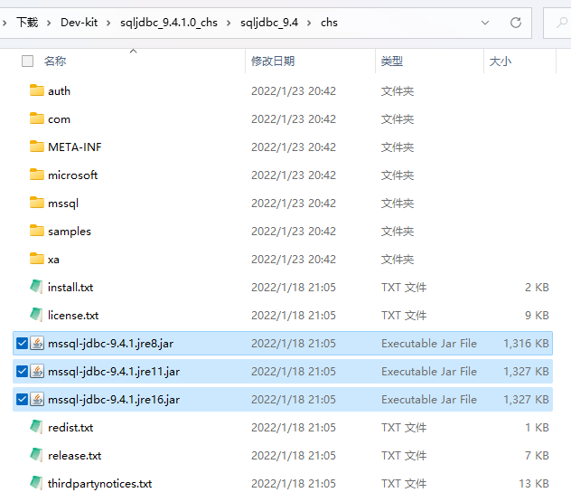

到`Drivers`，找到`Microsoft SQL Server`，IDEA会自动搜索到最新的驱动版本，点击下载。

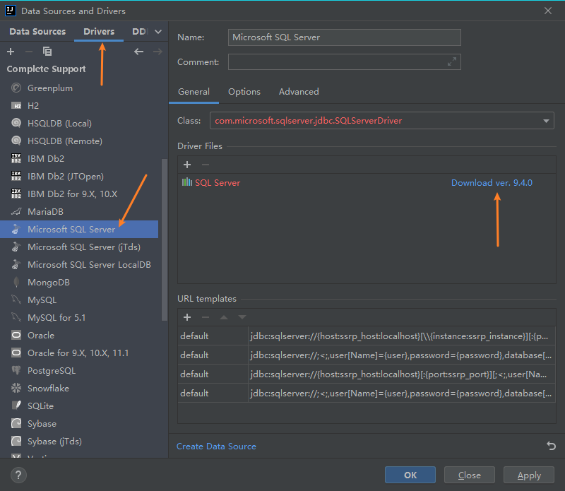

也可以手动选择版本。

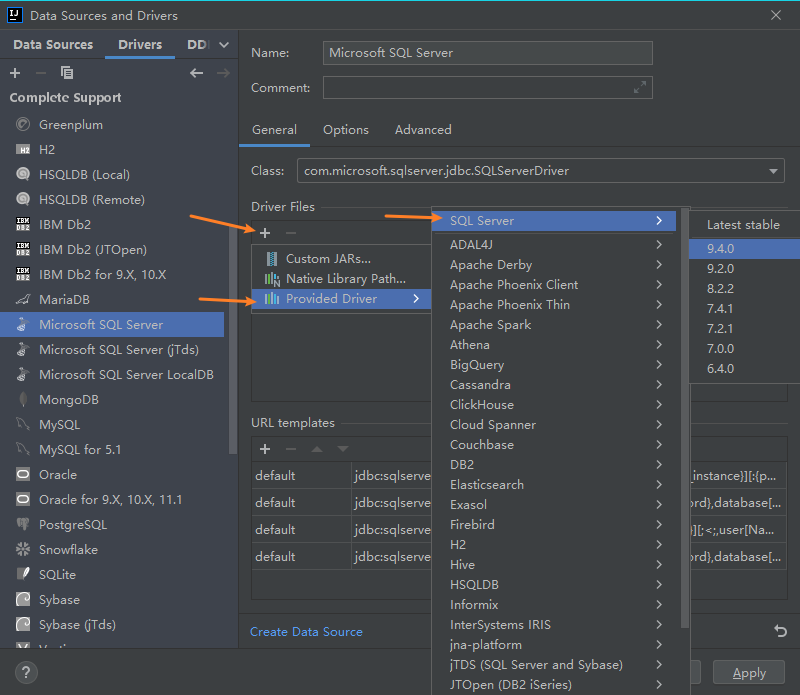

## 添加到项目依赖项

如果是在IDEA内下载的JDBC驱动，其`jar`包都在`%APPDATA%\JetBrains\IntelliJIdea<版本号>\jdbc-drivers\`目录下。

比如MS SQL Server的JDBC驱动9.4.0版本在`%APPDATA%\JetBrains\IntelliJIdea2021.3\jdbc-drivers\SQL Server\9.4.0\mssql-jdbc-9.4.0.jre8.jar`。

到`Project Structure`设置中，`Modules->Dependencies`添加驱动`JAR`包。

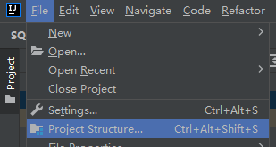

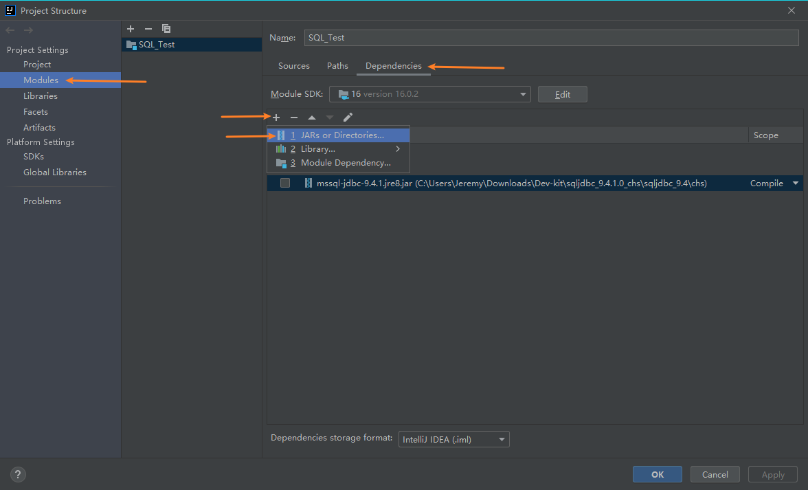

## 编程测试

驱动类名：`com.microsoft.sqlserver.jdbc.SQLServerDriver`

SQL Server连接字符串基本格式：`jdbc:sqlserver://<IP>:<PORT>;database=<DB_NAME>;user=<USER>;password=<PWD>`

以系统数据库`master`的系统表`MSreplication_options`为例：

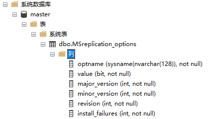

查询前四列内容：`SELECT optname, value, major_version, minor_version FROM MSreplication_options`

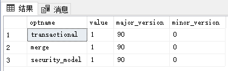

```java
import java.sql.*;

public class Test {
    public static void main(String[] args) throws Exception {
        // (1) 注册驱动
        Class.forName("com.microsoft.sqlserver.jdbc.SQLServerDriver");
        // (2) 用「连接字符串」连接数据库
        String url = "jdbc:sqlserver://localhost:1433;database=master;user=sa;password=123456";
        try (Connection conn = DriverManager.getConnection(url)) {
            // (3) 执行查询语句
            Statement stmt = conn.createStatement();
            String SQL = "SELECT optname, value, major_version, minor_version FROM MSreplication_options";
            ResultSet rs = stmt.executeQuery(SQL);
            // (4) 游标提取结果
            while (rs.next()) {
                System.out.printf("%-16s", rs.getString(1));
                // bit类型数据可以用Java中的Boolean保存
                System.out.printf("%-8b", rs.getBoolean(2));
                System.out.printf("%-8d", rs.getInt(3));
                System.out.printf("%-8d\n", rs.getInt(4));
            }
        }
        catch (SQLException e) {
            e.printStackTrace();
        }
    }
}
```

运行结果：

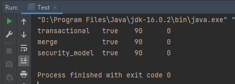

## 配置Data Source快速查看DB、执行SQL语句、提示

和**从JetBrains下载JDBC驱动**一样，到`Data Source Properties`中去。

如果是从JB下载的JDBC驱动，直接下一步。否则，如果是自行下载的JDBC驱动，那么到`Driver`选项卡，选择到你的数据库产品，点击`Driver Files`的加号，选择**JDK1.8的JDBC驱动**。

然后选择到`Data Source`选项卡，点击加号添加数据源，按你的端口号、登录方式、数据库名字填写。

点击最下面的`Connection Test`，测试能否正常连接。失败的话就检查数据库的设置，比如密码是否正确、用户名能否用于登录。

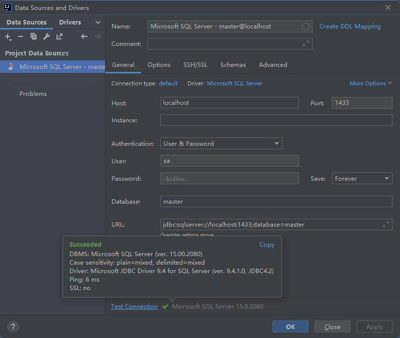

这样，就能正常使用数据源插件带来的便利了。这个插件不止IDEA，在PyCharm、CLion等等其他的JerBrains产品中也有，但都依赖于JDBC驱动运行，配置过程都一样。

比如可以直接在`Database`侧栏中查看表的定义：

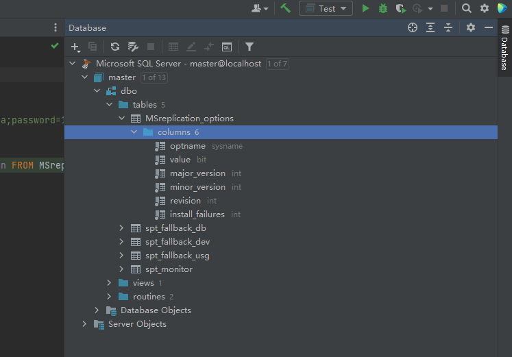

也可以在代码中获得提示信息：

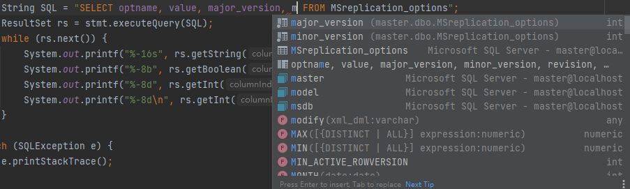
